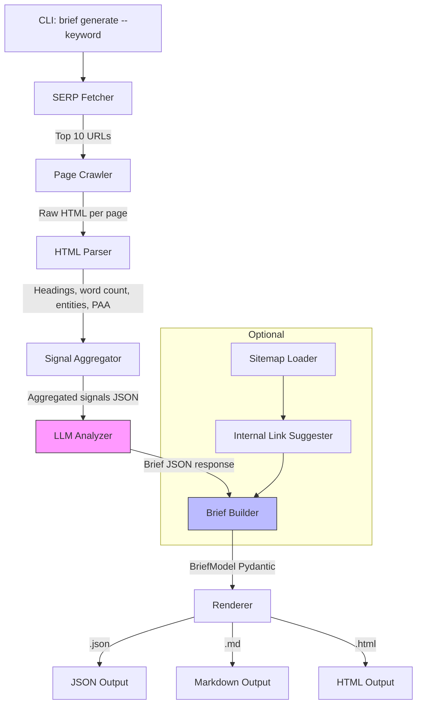

# llm-content-brief-engine

[](LICENSE)
[](https://python.org)
[](https://github.com/mehranmoghadasi/llm-content-brief-engine)

> An open-source Python CLI that transforms a single target keyword into a fully structured SEO content brief — crawling top organic results, extracting competitor signals, and running LLM analysis to produce a ready-to-use brief in HTML, Markdown, and JSON formats in under 60 seconds.

```
Mockup — Terminal + HTML Brief Output

╔══════════════════════════════════════════════════════════╗
║  llm-content-brief-engine  v0.3.0                        ║
║  Keyword: "email marketing automation for agencies"      ║
╠══════════════════════════════════════════════════════════╣
║  ✓ Crawled 10 SERP results           [2.4s]              ║
║  ✓ Parsed headings + entities        [0.8s]              ║
║  ✓ Aggregated PAA questions (12)     [0.3s]              ║
║  ✓ LLM analysis complete             [6.1s]              ║
╠══════════════════════════════════════════════════════════╣
║  Brief Summary                                           ║
║  ─────────────────────────────────────────────          ║
║  Target word count:      2,100 – 2,600                   ║
║  Primary intent:         Commercial investigation        ║
║  Top entities to cover:  HubSpot, Mailchimp, drip seq.   ║
║  Recommended H2s:        8 sections (see brief)          ║
║  Competitor gap topics:  3 angles competitors miss       ║
╠══════════════════════════════════════════════════════════╣
║  Output files                                            ║
║  brief_email-marketing-automation.html  ✓                ║
║  brief_email-marketing-automation.md    ✓                ║
║  brief_email-marketing-automation.json  ✓                ║
╚══════════════════════════════════════════════════════════╝
```

## The Problem

Agencies write content briefs by manually visiting 10+ SERP results, copy-pasting competitor headings into a doc, counting words, guessing at entities, and manually collecting People Also Ask questions. This takes **2–4 hours per brief** — time that repeats every time a new piece is needed. A [2025 Whatagraph survey of 200 agencies](https://whatagraph.com/blog/articles/ai-seo-tools) found content brief preparation was the single most time-consuming pre-writing task, yet all AI brief tools are closed SaaS priced $99–$400/month with restricted free tiers.

## The Solution

`llm-content-brief-engine` treats a content brief as a data pipeline: crawl → parse → aggregate → LLM inference → render. It is entirely self-hosted, accepts your own LLM API key, produces structured output (JSON, Markdown, HTML), and runs from a single CLI command. The HTML output is design-ready for sharing with writers. No subscription, no per-brief pricing, no data leaving your infrastructure except via your own API key.

## Features

- **SERP crawling** — fetches top 10 organic result URLs for a keyword (via DuckDuckGo HTML or SerpAPI when a key is provided)
- **Structural extraction** — parses each page for H1/H2/H3 hierarchy, approximate word count, meta description, and canonical URL
- **Entity aggregation** — uses frequency analysis across all results to surface the named entities and topics that dominate the competitive landscape
- **PAA harvesting** — extracts People Also Ask questions directly from SERP HTML for inclusion in the brief's FAQ/subheading suggestions
- **LLM brief synthesis** — sends aggregated signals to OpenAI (GPT-4o or GPT-4o-mini) or Anthropic (Claude 3.5 Sonnet) to generate: recommended word count range, heading structure, topics not covered by competitors, entity checklist, and opening hook suggestions
- **Three output formats** — JSON (machine-readable, useful as pipeline input), Markdown (for CMS paste), and styled HTML (for sharing with writers)
- **Competitor gap detection** — identifies topics covered by <30% of top results but present in PAA, flagging content differentiation opportunities
- **Optional sitemap integration** — if you provide a sitemap URL, the CLI suggests internal linking anchors from existing content
- **Dry-run / cost estimate mode** — shows token estimate and approximate API cost before sending any LLM request
- **Configurable via `.env`** — API keys, model selection, output directory, max results all environment-configured; no hardcoded values
- **Rate-limit safe** — crawling uses configurable delays and respects `robots.txt` directives for each target URL

## Architecture



**Key tradeoffs:** Crawling 10 pages adds 2–5 seconds of latency but grounds the LLM output in actual SERP reality rather than hallucinated competitor content. The Pydantic `BriefModel` acts as a contract between the LLM response parser and the renderers — if the LLM returns malformed JSON the parser falls back gracefully and flags incomplete sections rather than crashing.

## Tech Stack

- **Language:** Python 3.11+
- **HTTP client:** `httpx` (async, with retry middleware)
- **HTML parsing:** `beautifulsoup4` + `lxml`
- **LLM integration:** `openai` SDK (also supports Anthropic via API-compatible endpoint)
- **Data validation:** `pydantic` v2
- **Templating:** `jinja2` (HTML brief)
- **CLI:** `click` + `rich` (progress bars, tables, colored output)
- **Config:** `python-dotenv`
- **Testing:** `pytest` + `pytest-httpx` for mocked HTTP responses

## Installation

**Prerequisites:** Python 3.11+, pip, an OpenAI or Anthropic API key.

```bash
# Clone and install
git clone https://github.com/mehranmoghadasi/llm-content-brief-engine.git
cd llm-content-brief-engine
pip install -e ".[dev]"

# Configure environment
cp .env.example .env
# Edit .env — set OPENAI_API_KEY (or ANTHROPIC_API_KEY + ANTHROPIC_MODEL)

# Verify installation
brief --version
```

## Usage

### Basic brief generation

```bash
brief generate --keyword "email marketing automation for agencies"
# Output: brief_email-marketing-automation.{html,md,json} in ./output/
```

### With custom output directory and model override

```bash
brief generate \
  --keyword "technical seo audit checklist" \
  --output-dir ./briefs/ \
  --model gpt-4o-mini \
  --max-results 8
```

### With sitemap for internal link suggestions

```bash
brief generate \
  --keyword "core web vitals optimization" \
  --sitemap https://yoursite.com/sitemap.xml \
  --output-dir ./briefs/
```

### Dry-run (show cost estimate, no API call)

```bash
brief generate --keyword "local seo for restaurants" --dry-run
# Estimated tokens: ~12,400 input + ~1,800 output
# Approximate cost (gpt-4o-mini): $0.004
```

### List recent briefs

```bash
brief list
```

## Sample Output

```
=== SEO Content Brief: email marketing automation for agencies ===
Generated: 2026-06-06  |  Model: gpt-4o-mini  |  Cost: ~$0.004

TARGET KEYWORD: email marketing automation for agencies
SEARCH INTENT: Commercial investigation (users evaluating platforms/services)
RECOMMENDED WORD COUNT: 2,100 – 2,600 words

HEADING STRUCTURE (recommended):
  H1: Email Marketing Automation for Agencies: The 2026 Guide
  H2: What Makes Agency Email Automation Different from DIY Tools?
  H2: The 5 Core Workflow Types Every Agency Needs
    H3: Welcome / Onboarding Sequences
    H3: Lead Nurture Drip Campaigns
    H3: Re-engagement Flows
  H2: Feature Comparison: Top Agency Email Platforms
  H2: How to Set Up Behavioral Triggers Without a Developer
  H2: Pricing Reality Check: Per-Contact vs Per-Send Models
  H2: Case Study: 3x Open Rate Lift with Segmentation
  H2: Frequently Asked Questions

TOP ENTITIES TO COVER (frequency across top 10 results):
  HubSpot (9/10), Mailchimp (8/10), ActiveCampaign (7/10),
  Klaviyo (6/10), drip campaigns (10/10), behavioral triggers (8/10)

COMPETITOR GAP OPPORTUNITIES (covered by <30% of results):
  1. "Self-hosted email automation for agencies" — only 2/10 cover this angle
  2. "GDPR-compliant multi-client email management" — 1/10 covers this
  3. "Email automation ROI calculator" — 0/10 include a calculation tool

PAA QUESTIONS TO ADDRESS:
  1. What is the best email automation tool for marketing agencies?
  2. How much does agency email automation cost?
  3. Can I manage multiple clients from one email automation platform?
  4. What is the difference between drip campaigns and triggered emails?
```

## Roadmap

- **SerpAPI / Brave Search integration** — replace DuckDuckGo HTML scraping with a paid API for more reliable SERP data
- **Competitor sentiment analysis** — LLM sentiment pass on each top-ranking page's comment section / review aggregation
- **Multi-language support** — extend to French, Spanish, German SERP crawling
- **Brief version diffing** — compare two briefs for the same keyword across time to detect SERP shifts
- **Obsidian / Notion export** — output brief in formats directly importable into popular PKM tools
- **Batch mode** — accept a CSV of keywords and produce briefs in parallel

## Project Structure

```
llm-content-brief-engine/
├── README.md
├── LICENSE
├── .gitignore
├── .editorconfig
├── .env.example
├── pyproject.toml
├── src/
│   └── content_brief/
│       ├── __init__.py
│       ├── crawler.py          # SERP + page fetching (httpx async)
│       ├── parser.py           # HTML extraction: headings, entities, word count, PAA
│       ├── llm_analyzer.py     # LLM API call, prompt construction, response parsing
│       ├── brief_builder.py    # assembles BriefModel from parsed signals + LLM output
│       ├── renderer.py         # Jinja2 HTML + Markdown + JSON rendering
│       └── cli.py              # Click CLI entry point + rich UI
├── templates/
│   └── brief.html.j2           # Jinja2 HTML brief template
├── tests/
│   ├── conftest.py
│   ├── test_crawler.py
│   ├── test_parser.py
│   └── test_brief_builder.py
├── docs/
│   ├── ARCHITECTURE.md
│   └── USAGE.md
├── examples/
│   └── sample_brief.md
└── output/                     # generated briefs (gitignored)
```

## Contributing

Issues and PRs are welcome — especially for additional LLM provider adapters (Gemini, Mistral) and SERP data source integrations. Please open an issue before a large PR to discuss approach.

## License

MIT — see [LICENSE](LICENSE).

## About the Author

[Mehran Moghadasi](https://github.com/mehranmoghadasi) is a digital marketing specialist and technical SEO practitioner focused on building open-source tooling that replaces expensive SaaS workflows for agencies. This project is part of a portfolio of marketing engineering tools at [github.com/mehranmoghadasi](https://github.com/mehranmoghadasi).
